# README

Este es un archivo README para el repositorio. A continuación, se describe el propósito del proyecto, cómo instalarlo y cómo utilizarlo.

# IMPORTANTE

Se le recomienda a usted realizar primero la lectura completa de este archivo antes de seguir cualquier paso mencionado.

# Descripción

Este proyecto consiste en un analizador léxico y sintáctico desarrollado con ANTLR4 y JavaScript (Node.js), basado en una gramática simple. El analizador procesa archivos de texto que contienen un código fuente; lo analiza léxica y sintácticamente e informa si hay errores, genera la tabla de tokens y lexemas correspondiente, construye el árbol sintáctico concreto de la entrada, y traduce el código fuente al lenguaje JavaScript, para luego ejecutarlo.

## Requisitos previos

- Tener instalado *Visual Studio Code* en su computadora para poder ejecutar el código de una manera sencilla, y para poder guiarse con el presente archivo sin tener complicaciones. Si aún no lo tiene instalado, se le recomienda instalar desde la página oficial: https://code.visualstudio.com/.
 *IMPORTANTE:* durante la instalación de VS Code, habilite la opción "Add to PATH" para que
pueda abrir VS Code desde una terminal con `code .`.
- Es necesario que tenga *Node.js* instalado en su sistema, ya que el proyecto esta construído con Node. En caso de no contar con Node instalado, se le recomienda instalarlo desde https://nodejs.org/es. Se requiere la *version 18* o *superior*.
- Es necesario tener *Java (JDK)* instalado en su sistema. Se requiere Java 11 o superior, aunque es recomendable instalar *Java 17* o *superior*.
- Debe instalar *GIT* desde la página oficial: https://git-scm.com/downloads. Éste Le permitirá clonar el repositorio desde VS Code o terminal. 

Para comprobar que está todo bien instalado, puede ejecutar los siguientes comandos en una terminal:
```bash
code -v

node -v

npm -v

java -version

git -v
```
Las respectivas salidas deberían ser:
```bash
versión de Visual Studio Code instalada
Ej.: 1.96.4
cd4ee3b1c348a13bafd8f9ad8060705f6d4b9cba
x64

versión de Node JS instalada
Ej.: v20.10.0 

versión de NPM instalada
Ej.: 10.2.3

versión de Java instalada
openjdk version "17.0.9" 2025-05-19

versión de GIT instalada
git version 2.43.0.windows.1
```
### Configuración de VS Code para trabajar con ANTLR
- Una vez que usted verifique que está todo instalado correctamente, debe instalar la *Extensión de ANTLR para VS Code* .
 1. En VS Code, presione `Ctrl + Shift + X`, o vaya a la sección de "Extensions" (bloque cuadrado con un cuadrante separado) que se encuentra en la barra lateral izquierda, y busque: "ANTLR4 grammar syntax support".
 2. Instale la extensión de Mike Lischke.
 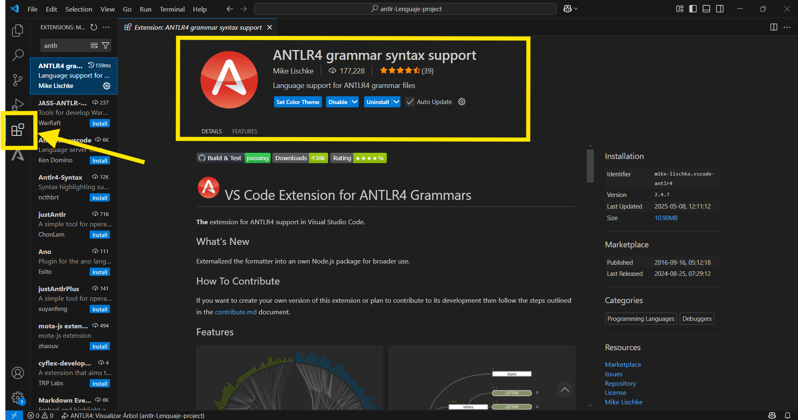
 *IMPORTANTE:* Luego de instalar la extensión, reinicie VS Code para que tome los cambios.

 3. Configure las preferencias de generación de código de ANTLR: vaya al menú Archivo/Preferencias/Configuración presionando `Ctrl + ,` y busque las preferencias de ANTLR. Baje hasta la sección Antlr4:Generation y edite `settings.json.`
 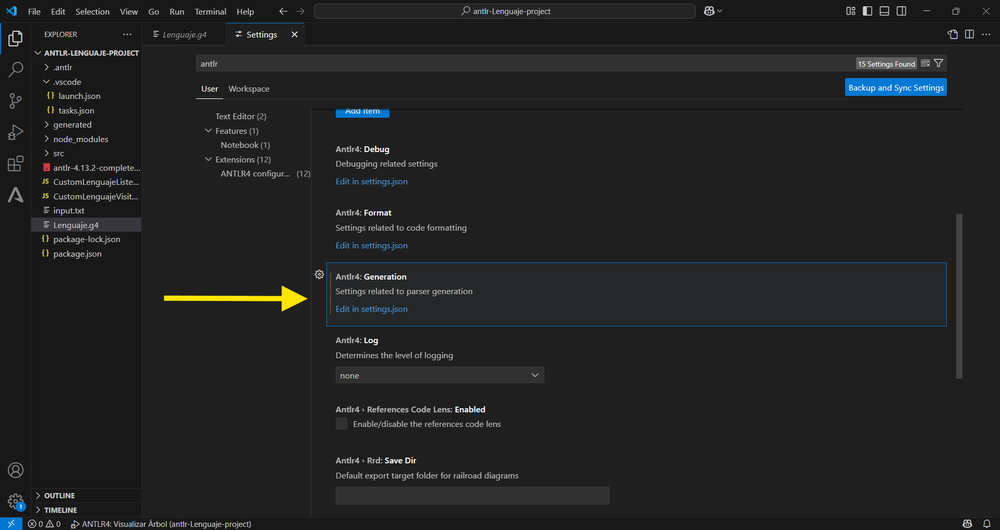

 La configuracion le debe quedar del siguiente modo:
 ```bash
    "antlr4.generation": {
        "alternativeJar": "antlr-4.13.2-complete.jar",
        "mode": "external",
        "listeners": true,
        "visitors": true,
        "language": "JavaScript",
        "outputDir": "./generated"
    } 
 ```
 *IMPORTANTE:* Guarde el archivo de configuración antes de continuar presionando `Ctrl + S`.


## Instalación

Clonar el repositorio y acceder al proyecto:
1. En una ventana de comandos, ejecute el siguiente comando:
```bash
git clone https://github.com/SantiZrpa/52168.git
```
- Si el proyecto se clonó correctamente, usted debería ver el mensaje “done” en su salida.

2. Ingrese a la carpeta raíz ejecutando:
```bash
cd 52168 // Esto no es la carpeta que se debe abrir en Visual Studio Code, pero si es la que contiene todo el repositorio.
```
3. Luego, muevase a la carpeta correcta del proyecto, ejecutando:
```bash
cd antlr-Lenguaje-project // Esta es la carpeta que debe abrir en VS Code.
```
4. Abra VS Code para trabajar con el código del proyecto. Para esto ejecute en la ventana
de comandos abierta:
```bash
code .
```
- Si todo está en orden, deberia usted poder ver y editar el proyecto en su VS Code.

 ## Otra Alternativa para clonar el proyecto (mas rápida y simple para algunos usuarios)

1. Acceder al siguiente link: https://github.com/SantiZrpa/52168 
2. Clickear `<> Code` (boton verde que aparece arriba de los archivos)  
3. Seleccionar la opción "Download ZIP" 
 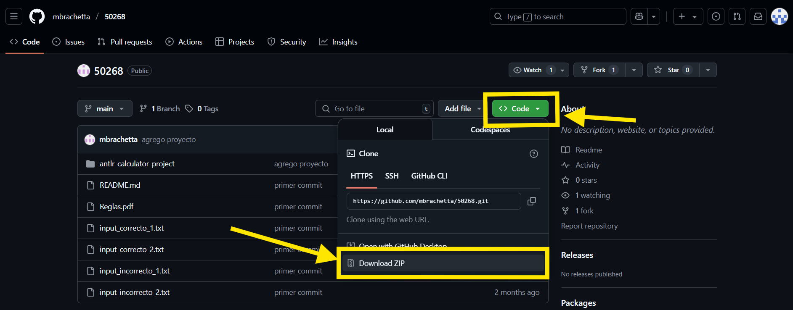
    
4. Una vez instalada, ingrese a Visual Studio Code
5. Dentro de VS Code, seleccione la opción "Open Folder..." y seleccione la carpeta `antlr-Lenguaje-project`, buscándola donde usted la haya instalado (debe acceder a la carpeta `52168.zip`, luego a la carpeta `52168` y luego a la carpeta correcta ya mencionada) 
 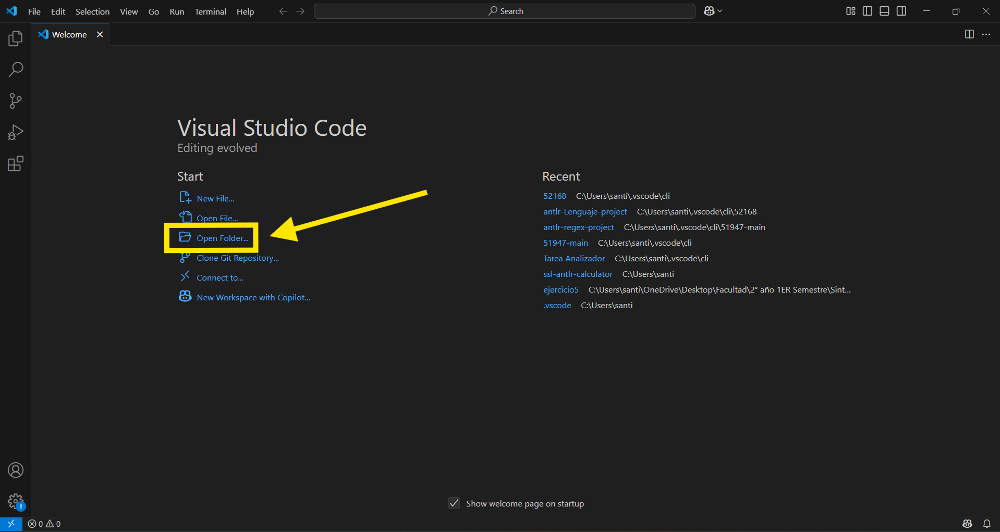

## ADVERTENCIA!!

- Al descargar o clonar este repositorio, es posible que se genere una carpeta principal llamada `51947/`. Es MUY importante NO abrir esta carpeta en VS Code. En su lugar, usted debe abrir directamente la carpeta `antlr-Lenguaje-project/` desde VS Code, ya que no contiene los archivos fuente del proyecto en su raíz.
- Esto evita problemas con rutas relativas, dependencias y ejecución del proyecto.
```bash
NO ABRIR → 52168/
SÍ ABRIR → 52168/antlr-Lenguaje-project/
```

## Ejecución

Al seleccionar el archivo Lenguaje.g4, usted podrá ver la gramática propuesta para este proyecto. Además, se adjunta un archivo de texto y un archivo pdf (llamado Reglas.pdf) en el repositorio, donde también se podrá visualizar la gramática asignada.
- Para la ejecución del programa, siga los siguientes pasos:
 1. En el repositorio de github usted encontrará unos archivos llamados *`input_correcto_1.txt`*, *`input_correcto_2.txt`*, *`input_incorrecto_1.txt`* e *`input_incorrecto_2.txt`*. En el proyecto dentro de VS Code, edite el archivo `input.txt`, agregando el contenido del ejemplo que usted desee. Una vez que lo tenga, es importante que guarde este archivo presionando `Ctrl + S`.
 
 2. Para ejecutar el programa, abra una terminal (En la barra superior de VS Code seleccione Terminal → New Terminal). Con una terminal "powershell" iniciada (Node.js), escriba y ejecute el siguiente comando: `node src index` o simplemente `node src`. También, si es de su gusto, puede ejecutar este comando en una consola de comandos, siempre y cuando esté en la dirección de la carpeta `antlr-Lenguaje-project`, es decir, debería ejecutarlo de una manera tal que así:
    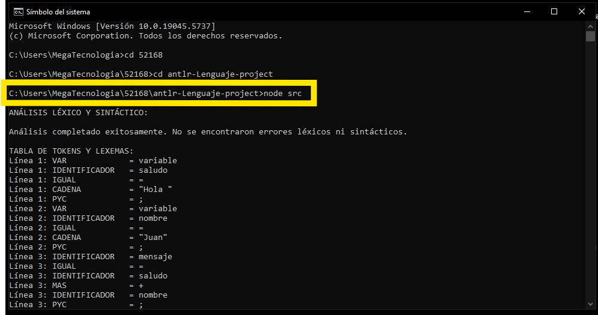

  - Otra opción es abrir una terminal "Command Prompt", seleccionando la "flecha hacia abajo" al lado del signo "+" en el panel de su terminal, y ejecutar el programa con el mismo comando o con el comando `cmd start` (Éste último solo funciona para este tipo de terminal).
  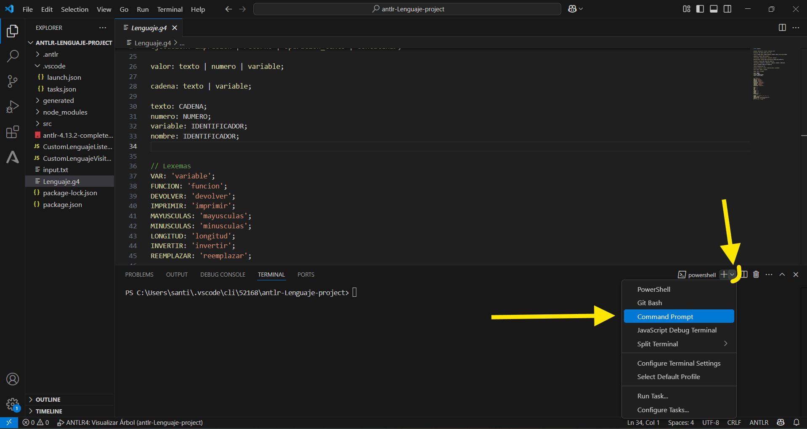
 
 3. Entre al archivo `Lenguaje.g4` y haga click en el botón de la extensión de ANTLR en la barra lateral izquierda de VS Code. Si el plugin de ANTLR quedó correctamente instalado, debería poder ver los tokens y las reglas gramaticales identificadas como se muestra en la figura:
     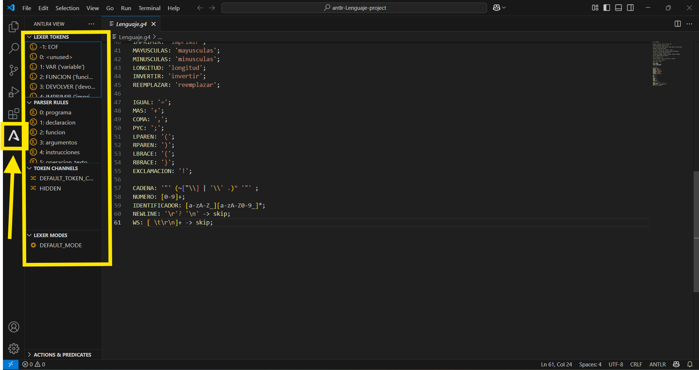
 
    *ADVERTENCIA:* 
    Si al seguir estos pasos no le aparece contenido en "Lexer Tokens", "Parser Rules", etc. dentro de la extensión de ANTLR, es probable que no se haya instalado de manera correcta el plugin de ANTLR en su VS Code, o que tenga un error con la versión de Java instalada. Para esto, verifique que instaló de manera correcta la extensión de ANTLR y su configuración, siguiendo todos los pasos previamente mencionados. Si es así, desinstale el plugin y vuelva a instalarlo, verifique si la configuración es correcta y reinicie VS Code para que se guarden los cambios. Si el problema persiste, verifique si su versión de Java instalada es Java JDK 17+. De no ser así, probablemente usted pueda ejecutar el programa pero no pueda depurar el archivo Lenguaje.g4, ya que le aparecerá una advertencia, posiblemente similar a esta:
     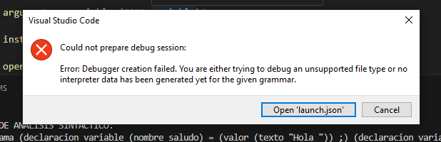

    Una vez que haya actualizado Java, posiblemente tenga que agregar la dirección de este a "PATH" en las variables del entorno del sistema. 
   
 
 4. Para generar y visualizar el árbol sintáctico, usted deberá depurar la gramática. Para esto usted debe:
  - Seleccionar el archivo de la gramática `Lenguaje.g4`.
  - Una vez dentro del archivo, iniciar el modo de depuración presionando F5 en su computadora o haciendo click en el botón "Run and Debug" que se encuentra en la barra izquierda de VS Code.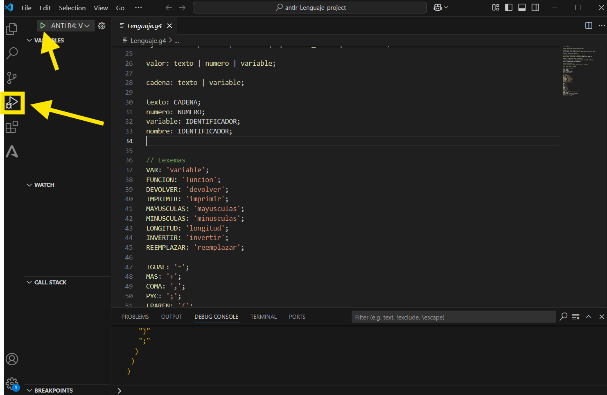

  - Si todo sale bien, usted podrá visualizar el árbol sintáctico de una manera similar a esto (varía según el contenido del archivo input.txt):
   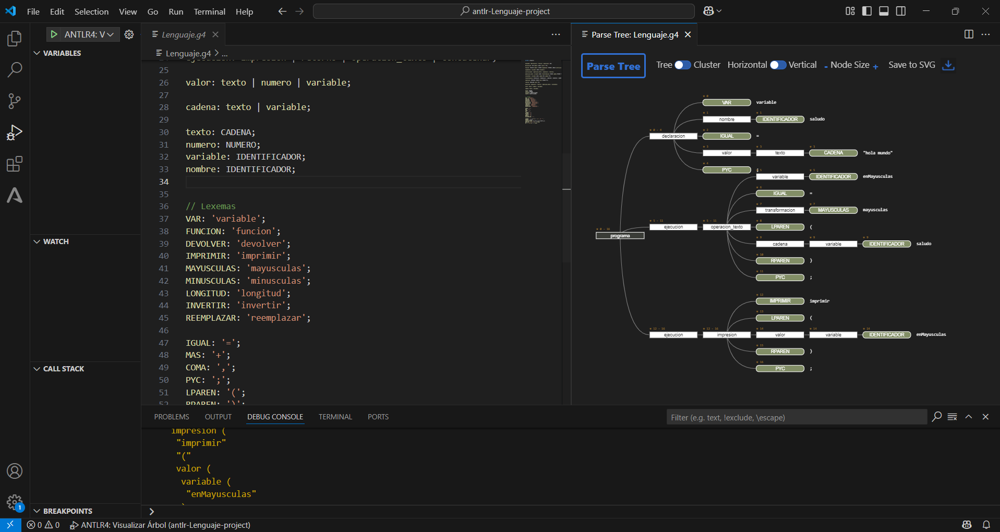

 ## &nbsp; 
 **Si elige un input correcto**:
 - Al ejecutar el programa, le aparecerá algo similar a esto:
   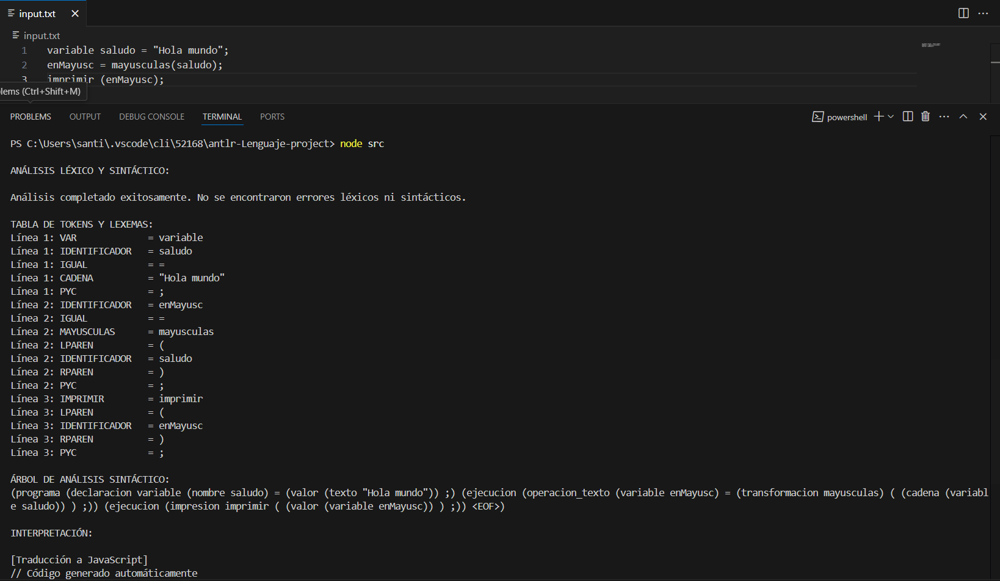

 ## &nbsp; 
 **Si elige un input incorrecto**:
 - Al ejecutar el programa, le aparecerá algo similar a esto:
   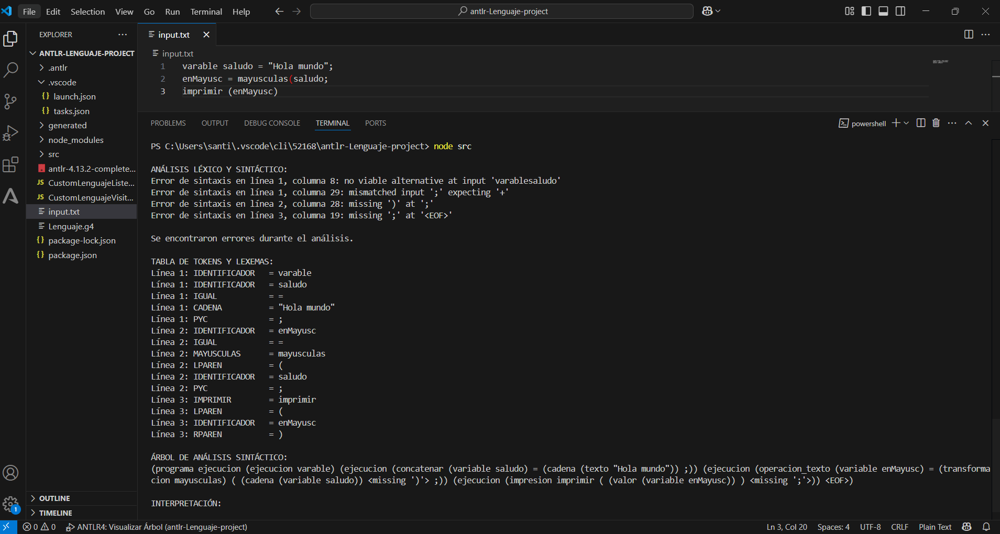

 ## &nbsp; 
 **Si el input.txt se encuentra vacio**:
 El programa se ejecutará; pero la tabla de tokens, el árbol de análisis sintáctico, y la interpretación del codigo se encontrarán sin contenido. Además, al estar el archivo vacío, no se detectarán erorres léxicos ni sintácticos.

## Créditos
Proyecto desarrollado como parte de la materia Sintáxis y Semántica de los Lenguajes - Universidad Tecnológica Nacional - FRM
Bibliografía importante: Guía de Estudio Construcción de Analizador con ANTLR4 + JavaScript https://campus.frm.utn.edu.ar/pluginfile.php/68894/mod_resource/content/3/Gu%C3%ADa%20de%20Estudio%20Construcci%C3%B3n%20de%20Analizador%20con%20ANTLR4%20%2B%20JavaScript.pdf
 ## Autor
 - Nombre: Santiago Zerpa
 - Legajo: 52168

